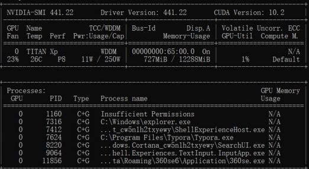
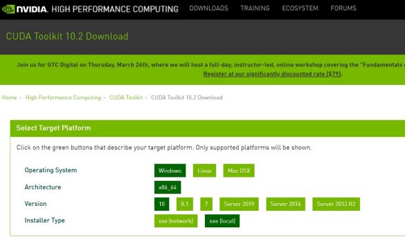
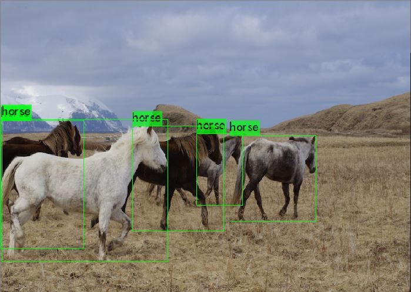
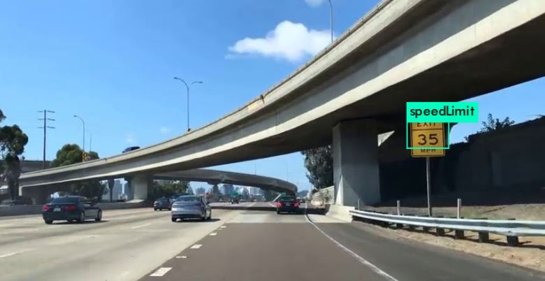
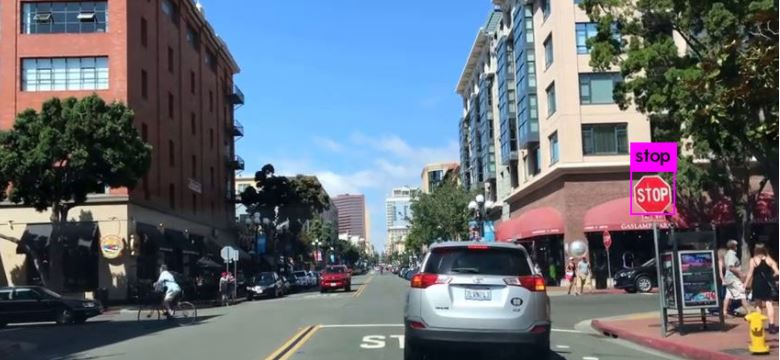

## YOLOv4 Traffic Sign Detection project

* This project describe the YOLOv4 model training based on darknet environment.

### 1. Software Setup
    *   Windows 10;
    *   Cuda 10.2;
    *   cudnn 7.6.5;
    *   Python 3.6;
    *   VisualStudio2019;
    *   Opencv 3.4.0
  
* Download Visual Studio Community
  Link : https://visualstudio.microsoft.com/downloads/
  

* Download Nvidia Driver
  Link : https://www.nvidia.com/Download/index.aspx

Input `nvidia-smi` in cmd to test the file. It will show :

* Download CUDA 
  The Latest version is CUDA 10.2.

* Download cuDNN
* 

* After the installation, it requires environment setup.
  
### 2. Download the weights file
Link : https://porter.io/github.com/AlexeyAB/darknet

### 3. Compile the Darknet model in Visual Studio
Make sure change the CUDA 10.0 to CUDA 10.2 in darknet.vcxproj file
`run darknet.exe detector test cfg\coco.data cfg\yolov4.cfg yolov4.weights` file to test the model

The vide testing file for YoloV4

### 4. Dataset for pretrain model
LISA : UCSD dataset, 47 classifications, `640 x 522 Pixels`.
* Pedestrain Sign
  
* Speed Limit Sign
  
* Stop Sign
  

### 4. Model improvements
* Using K-means++ to modify the size of cfg file
* Using Non Maximum Suppression method to delete redudant bounding box